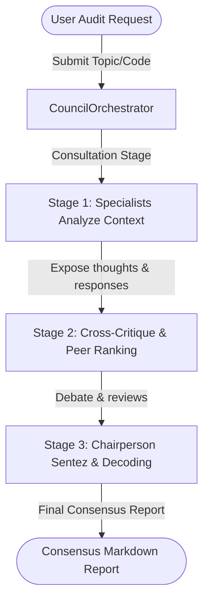

# 🏛️ AegisCouncil (v1.5.0)
### Autonomous 3-Agent LLM Consensus System for Code Reviews, Security Audits, and Architectural Checks

[English](README.md) | [Türkçe](README_TR.md)

AegisCouncil is an advanced, 3-stage autonomous AI consensus system designed to analyze, audit, and critique complex codebases, software architectures, and cybersecurity vulnerabilities. By combining the distinct intelligence of multiple specialized AI agents, AegisCouncil eliminates individual model "blind spots" and delivers highly rigorous, objective technical reviews.

---

## 🚀 Key Features

- **Specialized AI Experts:** Orchestrates 3 distinct specialist agents:
  - **Technical Expert (Senior Software Architect):** Focuses on code quality, design patterns (SOLID), scalability, and performance.
  - **Security Auditor (Senior Cybersecurity Engineer):** Scans for logical flaws and cybersecurity vulnerabilities (OWASP, CWE), producing a calculated Security Integrity Score.
  - **Visionary (Product Visionary & AI Architect):** Identifies modern technological innovations and long-term growth opportunities.
- **Deep Transparency Protocol:** Peer agents do not merely see final answers; they inspect each other's raw internal thought processes (`thought` fields) to identify inconsistencies or logical fallacies.
- **Inner Dialogue Protocol:** Council members communicate in a dense, structured technical format (English/JSON) for maximum precision, which is then synthesized by the Chairperson into a detailed Turkish report for the user.
- **Multi-Model Consensus:** Designed to run across various LLMs (e.g., Grok, Gemini, GPT-4o) via OpenRouter to ensure unbiased, multi-perspective results.

---

## 🏗️ Consensus Architecture



---

## 🛠️ Requirements & Setup

### Prerequisites
- Python 3.10+
- OpenRouter API Key configured in your environment variables.

### Installation
1. Clone the repository:
   ```bash
   git clone git@github.com:Ads-nht/AegisCouncil.git
   cd AegisCouncil
   ```
2. Create and activate a virtual environment:
   ```bash
   python3 -m venv .venv
   source .venv/bin/activate
   ```
3. Install dependencies:
   ```bash
   pip install -r requirements.txt
   ```

### Execution
Run an audit by passing your topic or local context file path as an argument:
```bash
python src/council_run.py "Your question, topic, or file path to audit"
```

---

## 📄 Repository Layout

- `src/council_orchestrator.py`: Core orchestration flow coordinating the 3-stage consensus pipeline.
- `src/council_prompts.py`: System prompt catalog containing optimized instructions for each agent.
- `src/council_run.py`: Command-line execution entrypoint with local file loading support.
- `docs/hafiza.md`: Technical ledger documenting system memory and internal protocols.
- `docs/ai_usage_guide.json`: structured handbook for other AI agents to execute council pipelines.

---

## 📄 License

This project is licensed under the MIT License.
