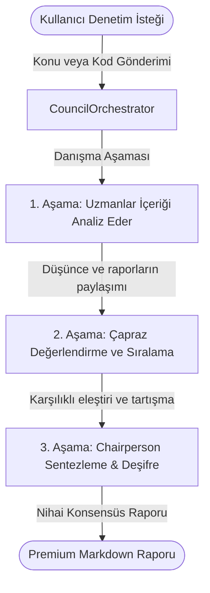

# 🏛️ AegisCouncil (v1.5.0 Premium)
### Kod İnceleme, Güvenlik Denetimleri ve Mimari Analizler İçin Otonom 3 Ajanlı LLM Konsensüs Sistemi

[English](README.md) | [Türkçe](README_TR.md)

AegisCouncil; karmaşık kod tabanlarını, yazılım mimarilerini ve siber güvenlik açıklarını analiz etmek, denetlemek ve eleştirmek için tasarlanmış 3 aşamalı otonom bir yapay zeka konsensüs sistemidir. Sistem, farklı uzmanlık alanlarına sahip yapay zeka ajanlarının zekasını birleştirerek bireysel modellerin "kör noktalarını" (blind spots) ortadan kaldırır ve son derece disiplinli, objektif teknik raporlar sunar.

---

## 🚀 Öne Çıkan Özellikler

- **Özelleştirilmiş Yapay Zeka Uzmanları:** Konsey, 3 farklı uzman ajanı koordine eder:
  - **Teknik Uzman (Senior Software Architect):** Kod kalitesi, tasarım desenleri (SOLID), ölçeklenebilirlik ve performansa odaklanır.
  - **Güvenlik Denetçisi (Senior Cybersecurity Engineer):** Siber güvenlik açıklarını (OWASP, CWE) ve mantıksal hataları tarayarak nesnel bir Güvenlik Skorlama Puanı üretir.
  - **Vizyoner (Product Visionary & AI Architect):** Modern teknolojik inovasyonları ve uzun vadeli ürün büyüme stratejilerini belirler.
- **Derin Şeffaflık Protokolü (Deep Transparency):** Uzman ajanlar birbirlerinin sadece nihai raporlarını değil, iç düşünce süreçlerini de (`thought` alanları) inceleyerek mantıksal boşlukları ve çelişkileri yakalar.
- **İç İletişim Protokolü:** Konsey üyeleri kendi aralarında en verimli teknik dilde (İngilizce/JSON) haberleşir; Chairperson tüm bu ham iç diyaloğu analiz ederek kullanıcıya Premium kalitede Türkçe bir rapor sentezler.
- **Çoklu Model Konsensüsü:** Grok, Gemini, GPT-4o gibi farklı LLM modellerini OpenRouter üzerinden koordine ederek tarafsız ve çok perspektifli sonuçlar sağlar.

---

## 🏗️ Konsensüs Mimarisi



---

## 🛠️ Sistem Gereksinimleri ve Kurulum

### Gereksinimler
- Python 3.10+
- Ortam değişkenlerinizde (environment variables) tanımlanmış OpenRouter API anahtarı.

### Kurulum
1. Depoyu bilgisayarınıza kopyalayın:
   ```bash
   git clone git@github.com:Ads-nht/AegisCouncil.git
   cd AegisCouncil
   ```
2. Sanal ortam (venv) oluşturun ve aktif edin:
   ```bash
   python3 -m venv .venv
   source .venv/bin/activate
   ```
3. Bağımlılıkları yükleyin:
   ```bash
   pip install -r requirements.txt
   ```

### Kullanım
Bir denetim başlatmak için konuyu veya yerel bir bağlam dosyası yolunu argüman olarak geçin:
```bash
python src/council_run.py "Denetlemek istediğiniz konu, soru veya dosya yolu"
```

---

## 📄 Dosya Yapısı

- `src/council_orchestrator.py`: 3 aşamalı konsensüs hattını koordine eden ana yönetim mantığı.
- `src/council_prompts.py`: Her uzman ajan için optimize edilmiş sistem promptlarının bulunduğu katalog.
- `src/council_run.py`: Yerel dosya okuma desteğine sahip komut satırı arayüzü (CLI).
- `docs/hafiza.md`: Sistem belleği ve protokol dökümantasyonunun tutulduğu teknik defter.
- `docs/ai_usage_guide.json`: Diğer yapay zeka ajanlarının bu konseyi otonom çalıştırabilmesi için yapılandırılmış kılavuz.

---

## 📄 Lisans

Bu proje MIT Lisansı ile lisanslanmıştır.
